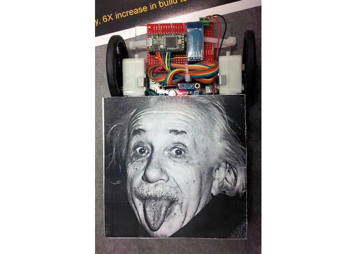

# BattleBot for Hack the North 2015 <b> Winner Of Best Game Award </b>
Augmented reality game, real robot vs virtual zombies.

https://devpost.com/software/battlebot

## Inspiration

We wanted built robots that fight. Without lots of money, we couldn't build those really cool battle robots equipped with flame throwers and chain saws. Feeling bummed out, we came up with the idea that, perhaps, we can get that experience in the virtual world. We wanted a game that can deliver both the rock-solid realism from the physical world and the mind-blowing effects from the virtual world. We strongly believe that this project will create some gaming experience that we have yet seen in the market. 

## What it does

The user will be driving around the robot and shoot virtual zombies using an Android phone. One wins if one kills all the zombies before they get to him or her. To other people, the user will just look like a maniac who is poking his or her phone rapidly and screaming at a seemingly empty space. Through the user's phone though, he or she can see many zombies roaming around and every second can be the difference between life and death (virtually). 
## Click to Watch

## Screenshots

.jpg)
.jpg)
.jpg	)

## How we built it

We developed the game using Unity and compiled it for Android phone. The augmented reality and marker tracking was done using Qualcomm's Vuforia. The robot was built using simple electronics components and a Teensy 3.1 microcontroller. Communication between the robot and the Android phone conducted via Bluetooth. 
